# LogiClean AI: Intelligent Logistics Data Validator

## 🚀 Overview
LogiClean AI is a specialized AI Agent designed to bridge the "System-to-System" data gap in global logistics. It automates the extraction and validation of shipping data (Addresses, PLZ, and Reference IDs) from unstructured sources like emails and PDFs.

### 🎯 The Problem
In industries like Aviation and Automotive, manual data entry into ERP systems is a high-risk bottleneck. 
* **Data Mismatches:** Incorrect Zip Codes lead to "Line Down" delays.
* **Format Errors:** Non-compliant Reference IDs cause customs rejection.
* **Manual Overhead:** Logistics specialists spend ~30% of their time correcting "Dirty Data."

### 🧠 The Solution
An AI-powered orchestration layer that:
1. **Extracts:** Uses LLMs to pull entities from messy, unstructured text.
2. **Validates:** Cross-references City/Zip data against regional master data (German PLZ focus).
3. **Format Enforcement:** Validates Reference IDs against strict industry patterns.
4. **Clean JSON Output:** Delivers "System-Ready" data for automated ERP injection.

```mermaid  
graph TD
    A[Unstructured Email] --> B(AI Agent: Extraction)
    B --> C{Validation Logic}
    C -- Match Found --> D[✅ Clean JSON Output]
    C -- Mismatch Found --> E[⚠️ Error Alert: Flag for Review]
    D --> F[ERP / SAP Integration]
```

## 🛠️ Tech Stack
* **Language:** Python 3.x
* **AI Model:** OpenAI GPT-4o-mini (Structured Output mode)
* **Data Validation:** Pydantic (Logic Enforcement)
* **Deployment:** GitHub (Documentation & Version Control)

## 🗺️ System Architecture (Sequence)
1. **Input:** Unstructured Email Body.
2. **AI Agent:** Extraction & Pattern Recognition.
3. **Validation Engine:** Checks City vs. Postal Code logic.
4. **Decision Gate:** - ✅ If Clean: Push JSON to ERP.
    - ❌ If Mismatched: Trigger "Manual Review" Alert.

    
## 📈 Business Impact
* **Risk Reduction:** Catching 99% of Zip/City mismatches before cargo moves.
* **Efficiency:** Reducing data processing time from minutes to milliseconds.
* **Scalability:** Enabling high-volume shipping without increasing administrative headcount.